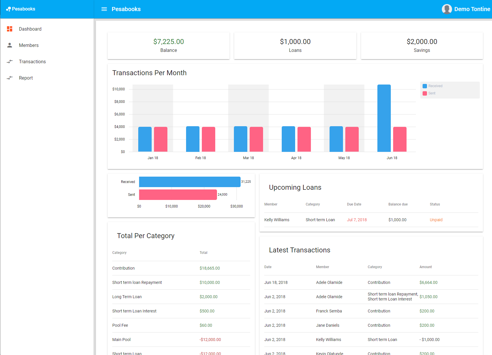

# Intro

This is the first version of Pesabooks, a light accounting software for tontines, built in 2018 with Angular 6 and hosting on Firebase.

# Screenshots

# Status
The project was abandoned due to many flaws with the current implementation:
- Firestore is not suitable as aggregation queries ar not supported. I had to create a bunch of function code to aggregate data, but for a financial software it is not the best. Especially for data integrity.
- The app was not implemented using [double entry system](https://www.freshbooks.com/hub/accounting/double-entry-bookkeeping)

I'm starting a new one with Aspnet core, postgreSql and Angular...stay tuned

